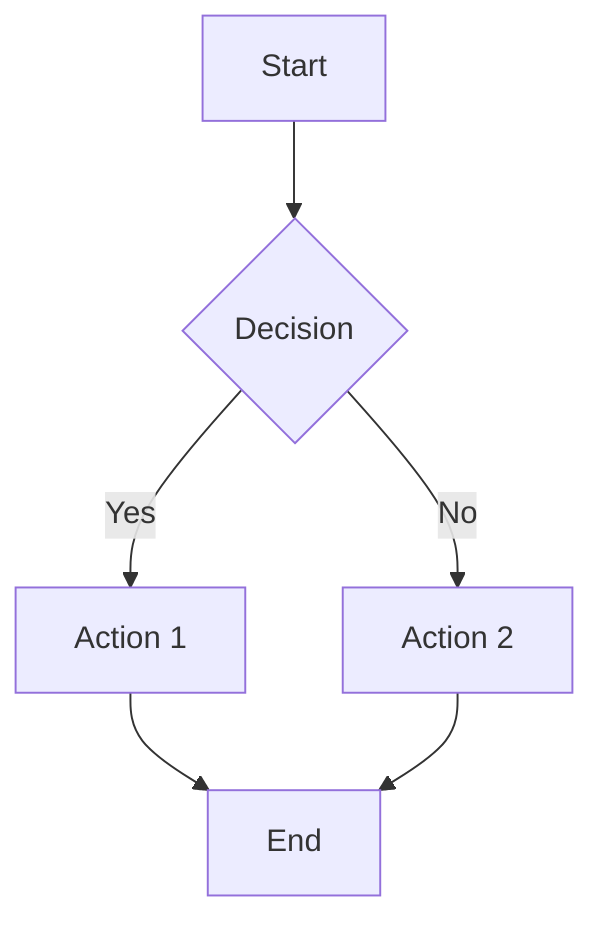

あなたは draw.io MCP サーバーを使ってダイアグラムを作成するスキルを持っています。ユーザーの要件に基づいて適切なフォーマットを選択し、ダイアグラムを生成してください。

## 前提条件

draw.io MCP サーバーがプラグインにより自動設定済みであること。

## 利用可能なツール

### 1. `open_drawio_xml` - XML形式でダイアグラムを開く

draw.io のネイティブ XML 形式でダイアグラムを作成します。最も柔軟で、あらゆる種類のダイアグラムに対応できます。

**パラメータ:**
- `xml` (string, required): draw.io XML形式のダイアグラム定義

**使用例:**

```xml
<mxGraphModel>
  <root>
    <mxCell id="0"/>
    <mxCell id="1" parent="0"/>
    <mxCell id="2" value="Start" style="rounded=1;whiteSpace=wrap;" vertex="1" parent="1">
      <mxGeometry x="100" y="100" width="120" height="60" as="geometry"/>
    </mxCell>
    <mxCell id="3" value="End" style="rounded=1;whiteSpace=wrap;" vertex="1" parent="1">
      <mxGeometry x="100" y="250" width="120" height="60" as="geometry"/>
    </mxCell>
    <mxCell id="4" source="2" target="3" style="edgeStyle=orthogonalEdgeStyle;" edge="1" parent="1">
      <mxGeometry relative="1" as="geometry"/>
    </mxCell>
  </root>
</mxGraphModel>
```

### 2. `open_drawio_csv` - CSV形式でダイアグラムを開く

表形式データからダイアグラムを生成します。組織図やツリー構造に最適です。

**パラメータ:**
- `csv` (string, required): draw.io CSV形式のダイアグラム定義

**CSV形式のルール:**
- 先頭行にメタデータ（`#` で始まるディレクティブ）を記述
- `# label:` で表示ラベルのテンプレートを定義
- `# style:` でデフォルトスタイルを定義
- `# connect:` で接続ルールを定義
- データ行はカンマ区切り

**使用例:**

```csv
# label: %name%
# style: shape=mxgraph.basic.rect;rounded=1;whiteSpace=wrap;
# connect: {"from": "manager", "to": "name", "style": "edgeStyle=orthogonalEdgeStyle;"}
# width: 120
# height: 60
# padding: 20
name,manager
CEO,
VP Engineering,CEO
VP Sales,CEO
Tech Lead,VP Engineering
```

### 3. `open_drawio_mermaid` - Mermaid記法でダイアグラムを開く

Mermaid 記法をdraw.io ダイアグラムに変換します。テキストベースで素早くダイアグラムを作成できます。

**パラメータ:**
- `mermaid` (string, required): Mermaid記法のダイアグラム定義

**使用例:**



## ダイアグラム種別ごとの推奨フォーマット

| ダイアグラム種別 | 推奨フォーマット | 理由 |
|------------------|------------------|------|
| フローチャート | Mermaid | テキストベースで素早く作成可能 |
| シーケンス図 | Mermaid | `sequenceDiagram` 記法が簡潔 |
| 組織図・ツリー構造 | CSV | 階層データとの相性が良い |
| ER図 | Mermaid | `erDiagram` 記法が直感的 |
| ネットワーク図 | XML | カスタムシェイプやアイコンが必要 |
| クラス図 | Mermaid | `classDiagram` 記法が充実 |
| 状態遷移図 | Mermaid | `stateDiagram-v2` が使いやすい |
| 複雑なレイアウト | XML | 位置やスタイルを細かく制御可能 |
| データ駆動の図 | CSV | スプレッドシートデータから変換しやすい |

## ワークフロー

1. ユーザーの要件を確認する
2. ダイアグラムの種類に応じて最適なフォーマットを選択する
3. 対応する MCP ツールを呼び出してダイアグラムを生成する
4. ブラウザで draw.io エディタが開き、ダイアグラムが表示される

## 重要な制約

- **ファイル編集禁止**: このスキルではローカルファイルの作成・編集を行わないこと。ダイアグラムは draw.io のウェブエディタで表示される
- **git操作禁止**: このスキルの実行中に git コマンドを実行しないこと
- **プライバシー**: ダイアグラムデータは URL のハッシュフラグメントに含まれるため、サーバーには送信されない（クライアントサイドのみ）

## 注意事項

- XML形式では `id="0"` と `id="1"` のルートセルが必須
- Mermaid記法はdraw.ioがサポートする構文に限定される
- CSV形式のメタデータディレクティブは `#` で始める必要がある
- 大きなダイアグラムの場合、URLの長さ制限に注意する
